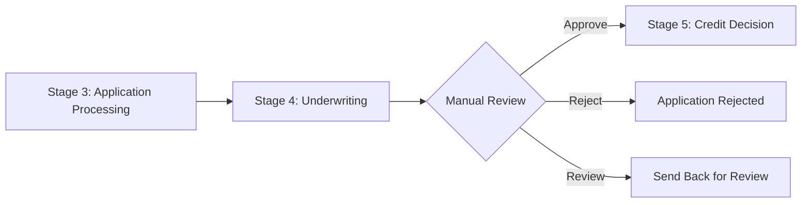
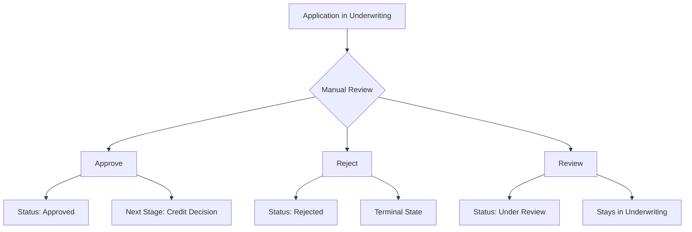

# Underwriting Dashboard API Documentation

## 🎯 Overview

This document provides comprehensive API documentation for the **Underwriting Dashboard System** that integrates with the existing 7-stage loan workflow. The underwriting stage (Stage 4) now includes enhanced dashboard capabilities for manual review, decision-making, and comprehensive application analysis.

**Base URL**: `http://localhost:3000/api/underwriting`

**Authentication**: Currently public (add authentication headers as needed)
**Content-Type**: `application/json`

---

## 📋 Table of Contents

1. [System Integration](#system-integration)
2. [Dashboard Endpoints](#dashboard-endpoints)
3. [Manual Decision Workflow](#manual-decision-workflow)
4. [Data Structures](#data-structures)
5. [Frontend Integration](#frontend-integration)
6. [Error Handling](#error-handling)
7. [Usage Examples](#usage-examples)

---

## 🔗 System Integration

### Integration with Existing 7-Stage Workflow

The underwriting dashboard integrates seamlessly with your existing loan origination workflow:

1. **Stage 1**: Pre-Qualification ✅
2. **Stage 2**: Loan Application Processing ✅
3. **Stage 3**: Application Processing ✅
4. **Stage 4**: **Underwriting** ← **Enhanced Dashboard**
5. **Stage 5**: Credit Decision ✅
6. **Stage 6**: Quality Check ✅
7. **Stage 7**: Loan Funding ✅

### Workflow Flow



---

## 🏗️ Dashboard Endpoints

### 1. Get Comprehensive Dashboard Data

**GET** `/api/underwriting/{applicationNumber}/dashboard`

Retrieves comprehensive underwriting data including risk assessment, financial analysis, verification data, and rule-based checks.

**Response:**
```json
{
  "success": true,
  "data": {
    "application_info": {
      "application_number": "EL_1756402515298_a6qwcx48h",
      "created_at": "2025-08-28T17:35:15.310Z",
      "current_stage": "underwriting",
      "status": "under_review",
      "loan_amount": 750000,
      "loan_purpose": "home_improvement",
      "preferred_tenure": 36
    },
    "personal_details": {
      "full_name": "JASHUVA PEYYALA",
      "mobile": "9876543210",
      "email": "jashuva.peyyala@example.com",
      "pan_number": "EMMPP2177A",
      "date_of_birth": "1998-09-25"
    },
    "employment_details": {
      "employment_type": "salaried",
      "company_name": "Tech Corp Ltd",
      "designation": "Software Engineer",
      "work_experience_years": 3,
      "monthly_salary": 75000
    },
    "income_details": {
      "monthly_salary": 75000,
      "other_income": 5000,
      "total_monthly_income": 80000,
      "existing_emi": 15000,
      "net_monthly_income": 65000
    },
    "banking_details": {
      "primary_bank": "HDFC Bank",
      "account_type": "Savings",
      "average_monthly_balance": 50000,
      "banking_relationship_years": 2
    },
    "third_party_data": {
      "cibil_data": {
        "score": 796,
        "grade": "EXCELLENT",
        "report": { /* Detailed CIBIL report */ }
      },
      "bank_analysis": { /* Bank statement analysis */ },
      "employment_verification": { /* Employment verification data */ },
      "pan_verification": { /* PAN verification data */ }
    },
    "risk_assessment": {
      "risk_factors": {
        "credit_score": 85,
        "income_stability": 78,
        "employment_history": 72,
        "debt_to_income": 65,
        "banking_behavior": 80,
        "loan_to_value": 75,
        "external_factors": 70
      },
      "overall_score": 75,
      "risk_category": "MEDIUM",
      "recommendation": "CONDITIONAL_APPROVE"
    },
    "financial_analysis": {
      "monthly_income": 80000,
      "existing_emi": 15000,
      "proposed_emi": 23456,
      "total_emi": 38456,
      "debt_to_income_ratio": 48.07,
      "foir": 48.07,
      "disposable_income": 41544,
      "dti_category": "FAIR",
      "affordability_score": 50
    },
    "rule_based_checks": {
      "individual_checks": {
        "age_criteria": { "status": "PASS", "message": "Age criteria met" },
        "income_criteria": { "status": "PASS", "message": "Income criteria met" },
        "employment_criteria": { "status": "PASS", "message": "Employment criteria met" },
        "credit_score_criteria": { "status": "PASS", "message": "Credit score criteria met" },
        "loan_amount_criteria": { "status": "PASS", "message": "Loan amount criteria met" },
        "banking_criteria": { "status": "PASS", "message": "Banking criteria met" },
        "document_criteria": { "status": "PASS", "message": "Document criteria met" },
        "policy_compliance": { "status": "PASS", "message": "Policy compliance met" }
      },
      "total_checks": 8,
      "passed_checks": 8,
      "compliance_score": 100,
      "overall_status": "COMPLIANT"
    },
    "underwriting_score": 75,
    "recommendation": {
      "recommendation": "CONDITIONAL_APPROVE",
      "confidence": 65,
      "reasons": [
        "Moderate risk profile",
        "Acceptable DTI ratio",
        "Good compliance"
      ],
      "suggested_conditions": [
        "Additional income verification",
        "Co-signer requirement"
      ]
    },
    "underwriting_history": [],
    "manual_decisions": []
  },
  "requestId": "req_1756405800000"
}
```

### 2. Make Manual Underwriting Decision

**POST** `/api/underwriting/{applicationNumber}/decision`

Allows underwriters to make manual decisions (Approve/Reject/Review) on applications.

**Request Body:**
```json
{
  "decision": "approve",
  "comments": "Application meets all underwriting criteria. Strong CIBIL score and stable employment.",
  "reviewer": "John Doe",
  "conditions": [
    "Final income verification required",
    "Property valuation to be completed"
  ]
}
```

**Request Parameters:**
- `decision` (required): One of `"approve"`, `"reject"`, or `"review"`
- `comments` (optional): Reviewer comments
- `reviewer` (required): Name/ID of the reviewer
- `conditions` (optional): Array of conditions for approval (only applicable for approve decision)

**Response:**
```json
{
  "success": true,
  "data": {
    "application_number": "EL_1756402515298_a6qwcx48h",
    "decision": "approve",
    "new_status": "approved",
    "next_stage": "credit_decision",
    "decision_date": "2025-08-28T18:30:00.000Z",
    "reviewer": "John Doe"
  },
  "message": "Underwriting approve decision recorded successfully",
  "requestId": "req_1756405800000"
}
```

### 3. Get Pending Applications

**GET** `/api/underwriting/pending`

Retrieves applications pending underwriting review.

**Query Parameters:**
- `limit` (optional): Number of records to return (default: 20)
- `offset` (optional): Number of records to skip (default: 0)
- `priority` (optional): Filter by priority level
- `assignedTo` (optional): Filter by assigned reviewer

**Response:**
```json
{
  "success": true,
  "data": [],
  "pagination": {
    "total": 0,
    "limit": 20,
    "offset": 0,
    "has_more": false
  },
  "requestId": "req_1756405800000"
}
```

### 4. Get Underwriting Status (Legacy)

**GET** `/api/underwriting/{applicationNumber}/status`

Get basic underwriting status for an application.

**Response:**
```json
{
  "success": true,
  "applicationNumber": "EL_1756402515298_a6qwcx48h",
  "status": {
    "applicationNumber": "EL_1756402515298_a6qwcx48h",
    "current_stage": "underwriting",
    "current_status": "approved",
    "underwriting_completed": true
  },
  "requestId": "req_1756405800000"
}
```

---

## ⚖️ Manual Decision Workflow

### Decision Types

1. **Approve**: Move application to next stage (Credit Decision)
2. **Reject**: Reject the application (terminal state)
3. **Review**: Send back for additional review (stays in underwriting)

### Decision Flow



### Status Transitions

| Current Status | Decision | New Status | Next Stage |
|----------------|----------|------------|------------|
| `under_review` | `approve` | `approved` | `credit_decision` |
| `under_review` | `reject` | `rejected` | `underwriting` |
| `under_review` | `review` | `under_review` | `underwriting` |

---

## 📊 Data Structures

### Application Info
```typescript
interface ApplicationInfo {
  application_number: string;
  created_at: string;
  current_stage: string;
  status: string;
  loan_amount: number;
  loan_purpose: string;
  preferred_tenure: number;
}
```

### Risk Assessment
```typescript
interface RiskAssessment {
  risk_factors: {
    credit_score: number;
    income_stability: number;
    employment_history: number;
    debt_to_income: number;
    banking_behavior: number;
    loan_to_value: number;
    external_factors: number;
  };
  overall_score: number;
  risk_category: 'LOW' | 'MEDIUM' | 'HIGH' | 'VERY_HIGH';
  recommendation: 'APPROVE' | 'CONDITIONAL_APPROVE' | 'REJECT';
}
```

### Financial Analysis
```typescript
interface FinancialAnalysis {
  monthly_income: number;
  existing_emi: number;
  proposed_emi: number;
  total_emi: number;
  debt_to_income_ratio: number;
  foir: number;
  disposable_income: number;
  dti_category: 'EXCELLENT' | 'GOOD' | 'FAIR' | 'POOR';
  affordability_score: number;
}
```

### Rule-Based Checks
```typescript
interface RuleBasedChecks {
  individual_checks: Record<string, {
    status: 'PASS' | 'FAIL';
    message: string;
  }>;
  total_checks: number;
  passed_checks: number;
  compliance_score: number;
  overall_status: 'COMPLIANT' | 'NON_COMPLIANT';
}
```

---

## 🎨 Frontend Integration

### React Component Usage

```jsx
import UnderwritingDashboard from './UnderwritingDashboard';

function App() {
  return (
    <div className="App">
      <UnderwritingDashboard applicationNumber="EL_1756402515298_a6qwcx48h" />
    </div>
  );
}
```

### API Integration Examples

**1. Fetch Dashboard Data:**
```javascript
const fetchUnderwritingData = async (applicationNumber) => {
  try {
    const response = await fetch(`/api/underwriting/${applicationNumber}/dashboard`);
    const result = await response.json();
    
    if (result.success) {
      return result.data;
    } else {
      throw new Error(result.error);
    }
  } catch (error) {
    console.error('Error fetching underwriting data:', error);
    throw error;
  }
};
```

**2. Make Manual Decision:**
```javascript
const makeDecision = async (applicationNumber, decisionData) => {
  try {
    const response = await fetch(`/api/underwriting/${applicationNumber}/decision`, {
      method: 'POST',
      headers: {
        'Content-Type': 'application/json',
      },
      body: JSON.stringify(decisionData)
    });
    
    const result = await response.json();
    
    if (result.success) {
      return result.data;
    } else {
      throw new Error(result.error);
    }
  } catch (error) {
    console.error('Error making decision:', error);
    throw error;
  }
};
```

**3. Custom Hook for Underwriting:**
```javascript
import { useState, useEffect } from 'react';

const useUnderwriting = (applicationNumber) => {
  const [data, setData] = useState(null);
  const [loading, setLoading] = useState(true);
  const [error, setError] = useState(null);

  useEffect(() => {
    fetchUnderwritingData(applicationNumber)
      .then(setData)
      .catch(setError)
      .finally(() => setLoading(false));
  }, [applicationNumber]);

  const makeDecision = async (decisionData) => {
    setLoading(true);
    try {
      const result = await makeDecision(applicationNumber, decisionData);
      // Refresh data after decision
      const updatedData = await fetchUnderwritingData(applicationNumber);
      setData(updatedData);
      return result;
    } catch (error) {
      setError(error);
      throw error;
    } finally {
      setLoading(false);
    }
  };

  return { data, loading, error, makeDecision };
};
```

---

## ❌ Error Handling

### Common Error Responses

**Application Not Found (404):**
```json
{
  "success": false,
  "error": "Application not found",
  "requestId": "req_1756405800000"
}
```

**Validation Error (400):**
```json
{
  "success": false,
  "error": "Valid decision is required (approve, reject, review)",
  "requestId": "req_1756405800000"
}
```

**Server Error (500):**
```json
{
  "success": false,
  "error": "Internal server error",
  "message": "Database connection failed",
  "requestId": "req_1756405800000"
}
```

### Error Handling in Frontend

```javascript
const handleApiError = (error, response) => {
  if (response?.status === 404) {
    return 'Application not found';
  } else if (response?.status === 400) {
    return 'Invalid request data';
  } else if (response?.status === 500) {
    return 'Server error occurred';
  } else {
    return 'Network error occurred';
  }
};
```

---

## 💡 Usage Examples

### Complete Underwriting Workflow

```javascript
// 1. Fetch application for review
const applicationData = await fetchUnderwritingData('EL_1756402515298_a6qwcx48h');

// 2. Analyze the data
console.log('Risk Score:', applicationData.underwriting_score);
console.log('DTI Ratio:', applicationData.financial_analysis.debt_to_income_ratio);
console.log('CIBIL Score:', applicationData.third_party_data.cibil_data?.score);

// 3. Make decision based on analysis
if (applicationData.underwriting_score >= 70 && 
    applicationData.financial_analysis.debt_to_income_ratio <= 40) {
  
  // Approve with conditions
  const decision = await makeDecision('EL_1756402515298_a6qwcx48h', {
    decision: 'approve',
    comments: 'Strong profile with good risk metrics',
    reviewer: 'Senior Underwriter',
    conditions: ['Final employment verification']
  });
  
  console.log('Application approved:', decision);
  
} else if (applicationData.underwriting_score < 40) {
  
  // Reject
  const decision = await makeDecision('EL_1756402515298_a6qwcx48h', {
    decision: 'reject',
    comments: 'Risk score below acceptable threshold',
    reviewer: 'Senior Underwriter'
  });
  
  console.log('Application rejected:', decision);
  
} else {
  
  // Send for review
  const decision = await makeDecision('EL_1756402515298_a6qwcx48h', {
    decision: 'review',
    comments: 'Requires additional assessment',
    reviewer: 'Senior Underwriter'
  });
  
  console.log('Sent for review:', decision);
}
```

### Dashboard Component Integration

```jsx
import React from 'react';
import UnderwritingDashboard from './UnderwritingDashboard';

const UnderwritingPage = ({ match }) => {
  const applicationNumber = match.params.applicationNumber;
  
  return (
    <div className="underwriting-page">
      <header>
        <h1>Loan Underwriting</h1>
        <p>Review and make decisions on loan applications</p>
      </header>
      
      <main>
        <UnderwritingDashboard applicationNumber={applicationNumber} />
      </main>
    </div>
  );
};

export default UnderwritingPage;
```

---

## 🔧 Configuration

### Environment Variables

```bash
# Database Configuration
DB_HOST=localhost
DB_PORT=3306
DB_USER=alpha
DB_PASSWORD=Alpha#777
DB_NAME=loan_origination_system

# API Configuration
PORT=3000
NODE_ENV=development

# CORS Configuration
ALLOWED_ORIGINS=http://localhost:3000,http://localhost:5173
```

### Feature Flags

The underwriting dashboard can be configured through the application configuration:

```javascript
// src/config/app.js
module.exports = {
  underwriting: {
    enableManualDecisions: true,
    enableRiskAssessment: true,
    enableFinancialAnalysis: true,
    enableRuleBasedChecks: true,
    defaultReviewTimeout: 24 * 60 * 60 * 1000, // 24 hours
  }
};
```

---

## 📝 Notes

1. **Request IDs**: All requests include a `requestId` for tracking and debugging
2. **Error Handling**: Always check the `success` field in responses
3. **Validation**: Required fields are validated on the server side
4. **Security**: Add authentication middleware for production use
5. **Performance**: Dashboard data is computed in real-time; consider caching for high-volume scenarios
6. **Audit Trail**: All manual decisions are logged for compliance and audit purposes

---

## ✅ Testing Checklist

- [ ] Dashboard data endpoint returns complete application information
- [ ] Risk assessment calculations are accurate
- [ ] Financial analysis (DTI, FOIR) calculations are correct
- [ ] Third-party data integration works properly
- [ ] Manual decision workflow (approve/reject/review) functions correctly
- [ ] Status transitions work as expected
- [ ] Error handling covers all edge cases
- [ ] Frontend component displays data correctly
- [ ] Modal decision form works properly
- [ ] Responsive design works on different screen sizes

---

**🎉 Your underwriting dashboard system is ready for production use!**

The system provides:
- ✅ Comprehensive application review dashboard
- ✅ Manual decision-making capabilities
- ✅ Risk assessment and financial analysis
- ✅ Third-party data integration
- ✅ Rule-based compliance checking
- ✅ Complete audit trail
- ✅ React component for frontend integration
- ✅ Full API documentation for developers
